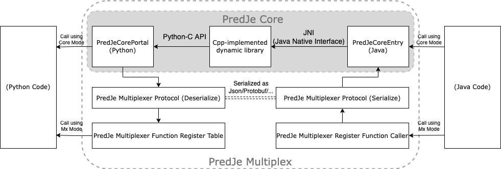

# PridJe: A Java-Python Bridge (Java Call Python)



## Introduction


PridJe (Java-Python Bridge) provides an interface between Java programs and functions/procedures written in Python (Java call Python). 

The usual solution of calling statistic/science/ML/AI algorithms of Python in efficient Java business programs is to set up Python-based servers and expose web APIs, but this might not be a good idea when resources are limited.

This project provides convenient interfaces (including core/mx mode) between Java programs and function procedures written in Python. It helps with the problem of lack of support when Java business processes calling python algorithm.

(Chinese version of introduction is in the next chapter / 中文介绍见下一章节)

### PredJe Core

PridJe core provides a local native interface (by dynamic library/ C-implemented JNI) that uses utf-8 strings to pass arguments from Java Virtual Machine to Python interpreter and fetch return value. 

The Java end of PredJe core is called PredJeCoreEntry, and the Python end is called PredJeCorePortal, the business code is written in this module. 

### PredJe Multiplexer

The default PredJe core only provides one process function, when there are more than one functions need to be called using PredJe core, users may define their own multiplexing protocols.

#### PredJe Json Multiplexer

This project provides a built-in multiplexing protocol that uses Json to decide which function to call and pass parameters(as long as they can be serialized to bytes, then converted by base64).

The registered functions should all be written in the PridJeJsonMXFuncReg module, and correctly imported by PredJeCorePortal. PredJeCorePortal is now running the multiplexer procedures instead of the real business logic (therefore it is not recommended modifying this module if using multiplexer mode).    

## 介绍

PridJe（Java-Python Bridge）提供Java调用Python的接口。

在高效的 Java 业务程序中调用 Python 的统计/科学/ML/AI 算法的通常解决方案是使用Python服务，用Web API调用计算服务，但在资源有限的情况下这可能效果不好。

该项目在Java程序和Python编写的函数程序之间提供了方便的接口（包括core核心和mx多路复用模式）。它有助于解决Java业务流程调用python算法时缺乏支持的问题。


### PredJe 核心

PridJe 核心提供了一个本地本地接口（通过动态库/C 实现的 JNI），它使用 utf-8 字符串将参数从 Java 虚拟机传递到 Python 解释器并获取返回值。

PredJe核心的Java端称为PredJeCoreEntry，Python端称为PredJeCorePortal，业务代码写在这个模块中。

### PredJe 多路复用器

PredJe 内核默认只提供一种处理函数，当需要使用 PredJe 内核调用多个函数时，用户可以定义自己的复用协议。

#### PredJe Json 多路复用器

本项目提供了一个内置的多路复用协议，使用Json来决定调用哪个函数并传递参数（只要可以序列化为字节，然后通过base64转换）。

注册的函数都应该写在 PridJeJsonMXFuncReg 模块中，并由 PredJeCorePortal 正确导入。 PredJeCorePortal 现在运行的是多路复用器程序而不是真正的业务逻辑（因此如果使用多路复用器模式，不建议修改此模块）。

（后续内容都用英文了）

## How to Compile PredJe

Set environment variables ```JAVA_HOME``` and ```PYTHON_HOME``` to the home dir of Java and Python.

If you are using MacOS(darwin), ```cd script/``` and ```sh make-install-pridje-core-macos.sh``` to build only PredJeCore or ```sh make-install-pridje-jsonmx-macos.sh``` to build PredJe core and json multiplexer.


Else, do it by the following steps:

### Step1. compile PridJe jars
Use ```sh compile-pridje-core-jar.sh``` or ```sh compile-pridje-jsonmx-jar.sh``` to compile the java libraries (this step is same on all platforms).

### Step2. compile PredJe Core Entry dynamic libraries

The source code is in ```jni/``` folder, compile ```pers_h01c_pridjecore_PridJeCoreEntry.cpp``` using your local cpp compiler;
note that the python libs and java headers/libs should be included:

```text 
-I$PYTHON_HOME/include/python3.9 
-I$JAVA_HOME/include 
-I$JAVA_HOME/include/darwin  
-L$PYTHON_HOME/lib
```

This step varies on different platforms.

### Step3. export files

Copy the output of the previous steps (jars and dynamic lib) to your project, and also copy the sample Python code in ```python/core/``` or ```python/jsonmx/``` to your project root dir.

If using Linux or MacOS, run ```cd script/``` and ```sh export-pridje-core-files.sh``` or ```sh export-pridje-jsonmx-files.sh```.

## How to use PredJe

Include the jar (in step 1) to class-path of your project and add the dynamic lib (in step 2) to library path of your project.
Import ```pers.h01c.predjecore.PredJeCoreEntry``` class or ```pers.h01c.pridjemultiplex.PridJeJsonMultiplexer``` class and start to use.

### Use PredJe in core mode

The Java module that needs to use PredJe core:

```java
// get PridJeCoreEntry object
// during the initialization of PridJeCoreEntry, it checks the dependencies (dynamic lib and python PredJeCorePortal)
// if fails, exception will be raised
PridJeCoreEntry c = null;
try {c = new PridJeCoreEntry();} 
catch (PridJeCoreEntry.PridJeCoreException e) {
            System.out.println(e.getErrorMessage());
}
// get process function through PredJe core
// pass the argument in string format and get return value in string format
// exception will be raised if execution of process function fails
String ret = null;
try {
     ret = c.CallProcessFunction("hell1o");
     System.out.println(ret);
} catch (PridJeCoreEntry.PridJeCoreException e) {
     System.out.println(e.getErrorMessage());
}
```

The sample PredJeCorePortal module:

```python
def process_function(input_string):
    return str(len(input_string))
```

### Use PredJe in json multiplexer mode

The Java module that needs to use PredJe json multiplexer:

```java
// need to get a PridJeCoreEntry object, too
PridJeCoreEntry c = null;
try {c = new PridJeCoreEntry();} 
catch (PridJeCoreEntry.PridJeCoreException e) {System.out.println(e.getErrorMessage());}

// get a PridJeJsonMultiplexer object, using PridJeCoreEntry object as parameter
PridJeJsonMultiplexer jm = new PridJeJsonMultiplexer(c);

JSONObject ret = null;
try {
     JSONObject inputArg = new JSONObject();
     inputArg.fluentPut("a", 1).fluentPut("b", 2); // construct the parameter json to pass to python function
     ret = jm.CallRegisteredFunction("func1", inputArg); // call "func1" in PridJeJsonMXFuncReg (python module)
} catch (PridJeCoreEntry.PridJeCoreException e) {
     System.out.println(e.getErrorMessage());
}
     System.out.println(ret);
}
```

The sample PridJeJsonMXFuncReg module:

```python
var1 = 0

def func1(a, b):
    return { "sum": a+b+var1}

```


## Exceptions

### PridJeCoreEntry initialization return code

```text
code=  1: (Everything is Normal)
code=  0: Process Function Execution Error
code= -1: Python Interpreter Failed to Start
code= -2: Process Function Load Error
code= -3: PridJeCore Portal Module Load Error

```

### com.alibaba.fastjson2 lib not found

This is a dependency lib, please ensure to import it if you are using json multiplexer mode.

###  module load error 

Try the following:

- Add VM option ```-Djava.library.path``` and let the Java library path to include the compiled dynamic lib.
- Make sure the python module are named and placed correctly (put ```PredJe/``` in project root dir and ```PredJeCorePortal.py``` in ```PredJe/``` folder).


## TODO

- add protobuf multiplexer
- change the core from string to raw byte
- add scripts to compile on Windows/Linux


